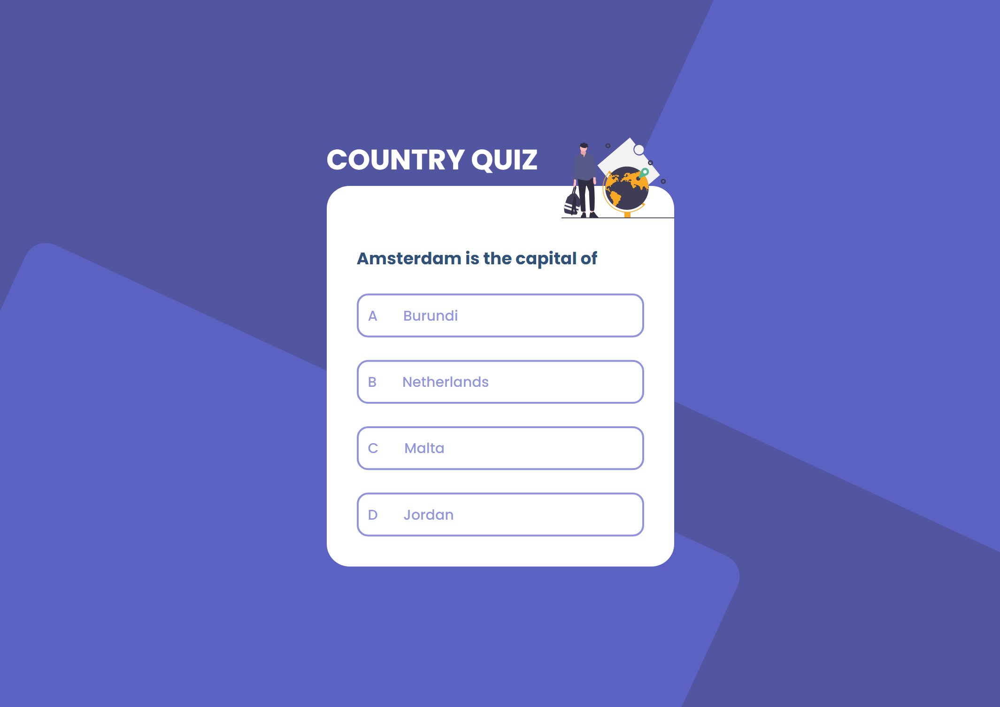

<h1 align="center">Country Quiz</h1>

  <h3>
    <a href="https://{your-demo-link.your-domain}">
      Live Demo
    </a>
     | 
    <a href="https://devchallenges.io/challenges/Bu3G2irnaXmfwQ8sZkw8">
      Challenge
    </a>
  </h3>

## Table of Contents

- [Overview](#overview)
  - [Built With](#built-with)
- [Features](#features)

## Overview

An interactive country quiz game using "Rest Country API"

### Built With

- HTML
- CSS
- JavaScript
- Rest Country API

## Features

- User can see 2 types of questions: `a city is the capital of..` or `a flag belong to country..`
- User can see select an answer
- User can see if answer is correct or incorrect
- When user answer correctly, User can move on to the next question
- When user answer incorrectly, User can see results and try again
